# Phase 7D: Future Integration Architecture

> **Status:** Design Only — no implementation until API credentials are obtained.

---

## 1. HubSpot CRM Sync Architecture

### Overview
Sync lead data from Supabase → HubSpot CRM so the sales team can nurture high-readiness leads with automated follow-ups, pipeline tracking, and attribution analytics.

### Data Flow


### Implementation Approach

#### New Edge Function: `hubspot-sync`
Triggered by Supabase Database Webhooks on `spark_leads` and `profiles` tables.

```typescript
// Pseudo-code for hubspot-sync Edge Function
Deno.serve(async (req) => {
  const { type, table, record, old_record } = await req.json();

  // Map Supabase fields → HubSpot properties
  const hubspotContact = {
    email: record.email,
    firstname: record.name?.split(' ')[0],
    lastname: record.name?.split(' ').slice(1).join(' '),
    // Custom properties
    spar_level: record.level,
    spar_streak: record.current_streak,
    spar_gold: record.gold,
    spar_booking_score: calculateBookingScore(record),
    spar_last_active: record.updated_at,
    lifecyclestage: record.level >= 5 ? 'opportunity' : 'lead',
  };

  // Upsert contact via HubSpot API
  await fetch('https://api.hubapi.com/crm/v3/objects/contacts', {
    method: 'POST',
    headers: {
      'Authorization': `Bearer ${Deno.env.get('HUBSPOT_ACCESS_TOKEN')}`,
      'Content-Type': 'application/json',
    },
    body: JSON.stringify({ properties: hubspotContact }),
  });

  // If booking score > 50, create/update Deal
  if (hubspotContact.spar_booking_score > 50) {
    // Create deal in "PT Consultations" pipeline
  }
});
```

#### HubSpot Custom Properties to Create

| Property | Type | Group | Source |
|---|---|---|---|
| `spar_level` | Number | Spar Mastery | `profiles.level` |
| `spar_streak` | Number | Spar Mastery | `profiles.current_streak` |
| `spar_gold` | Number | Spar Mastery | `profiles.gold` |
| `spar_booking_score` | Number | Spar Mastery | `getBookingReadiness()` |
| `spar_last_active` | DateTime | Spar Mastery | `profiles.updated_at` |
| `spar_paywall_hit` | Boolean | Spar Mastery | `spark_leads.upgrade_intent` |
| `spar_fitness_goal` | Text | Spar Mastery | `user_memories` |

#### HubSpot Workflow Automations

| Trigger | Action |
|---|---|
| Score > 70 + no booking | Send "Your coach thinks you're ready" email |
| Score > 50 + paywall hit | Sales rep task: "High-intent lead, call within 24h" |
| 7 days inactive + Score > 30 | Send "Your streak misses you" re-engagement |
| Booking completed | Move Deal → "Won", send trainer prep email |

### Prerequisites
- [ ] HubSpot API access token (Private App)
- [ ] Custom property group "Spar Mastery" created
- [ ] Pipeline "PT Consultations" with stages: Lead → Contacted → Booked → Attended → Won
- [ ] Supabase Database Webhook configured on `spark_leads` + `profiles`

---

## 2. Typeform/Quiz Integration Architecture ("Fitness DNA")

### Overview
A pre-coaching quiz that captures fitness DNA (goals, experience, restrictions, schedule) to hyper-personalize the AI Coach and provide warmer leads to the CRM.

### Data Flow


### Implementation Approach

#### New Edge Function: `typeform-webhook`

```typescript
// Pseudo-code for typeform-webhook Edge Function
Deno.serve(async (req) => {
  const payload = await req.json();
  const answers = payload.form_response.answers;

  // Extract fitness DNA from quiz answers
  const fitnessDNA = {
    goal: answers.find(a => a.field.ref === 'goal')?.choice?.label,
    experience: answers.find(a => a.field.ref === 'experience')?.choice?.label,
    injuries: answers.find(a => a.field.ref === 'injuries')?.choices?.labels || [],
    schedule: answers.find(a => a.field.ref === 'schedule')?.choice?.label,
    budget: answers.find(a => a.field.ref === 'budget')?.choice?.label,
    location: answers.find(a => a.field.ref === 'location')?.choice?.label,
    email: answers.find(a => a.field.ref === 'email')?.email,
  };

  const supabase = createClient(/* ... */);

  // 1. Upsert lead with enriched data
  await supabase.from('spark_leads').upsert({
    email: fitnessDNA.email,
    fitness_goal: fitnessDNA.goal,
    experience_level: fitnessDNA.experience,
    location: fitnessDNA.location,
    quiz_completed: true,
  }, { onConflict: 'email' });

  // 2. Pre-seed AI memories for personalized coaching
  const userId = await getUserIdByEmail(fitnessDNA.email);
  if (userId) {
    const memories = [
      { content: `Goal: ${fitnessDNA.goal}`, category: 'goal', importance: 9 },
      { content: `Experience: ${fitnessDNA.experience}`, category: 'fitness', importance: 7 },
    ];
    if (fitnessDNA.injuries.length > 0) {
      memories.push({ content: `Injuries: ${fitnessDNA.injuries.join(', ')}`, category: 'health', importance: 10 });
    }
    for (const mem of memories) {
      await supabase.from('user_memories').insert({ user_id: userId, ...mem });
    }
  }
});
```

#### How Fitness DNA Feeds the AI Coach

| DNA Signal | AI Prompt Injection | Example Output |
|---|---|---|
| Goal: Lose fat | "User's primary goal is fat loss" | "For fat loss, I recommend HIIT over steady-state..." |
| Injuries: Shoulder | "User has shoulder injury — NEVER suggest overhead presses" | Avoids dangerous exercises automatically |
| Experience: Beginner | "User is a beginner — use simple language, encourage" | Supportive tone, basic exercise suggestions |
| Schedule: Mornings | "User prefers morning workouts" | "Rise and grind! Here's your 6am warm-up..." |
| Location: Business Bay | "User is in Business Bay" | "There's a great gym near DIFC for this routine" |

### Prerequisites
- [ ] Typeform account + quiz built
- [ ] Typeform webhook URL pointing to Edge Function
- [ ] `fitness_dna` JSONB column on `profiles` table (migration)
- [ ] `quiz_completed` boolean on `spark_leads` table (migration)

---

## 3. Combined Architecture (Full Vision)

```mermaid
graph TB
    USER["👤 User"] --> QUIZ3["📋 Quiz (Typeform)"]
    USER --> APP3["📱 App (Spar Mastery)"]

    QUIZ3 -->|"typeform-webhook"| SUP3["🗄️ Supabase"]
    APP3 -->|"Direct writes"| SUP3

    SUP3 -->|"hubspot-sync"| HS3["🔶 HubSpot CRM"]
    SUP3 -->|"ai-coach"| AI3["🤖 AI Coach (Gemini)"]

    AI3 -->|"Personalized coaching"| APP3
    HS3 -->|"Automated nurture"| EMAIL["📧 Email Sequences"]
    HS3 -->|"Sales tasks"| SALES3["👔 Sales Team"]

    SALES3 -->|"Books session"| PTD3["🏋️ Real PT Session"]
    APP3 -->|"Booking modal"| PTD3

    style USER fill:#8b5cf6,stroke:#fff,color:#fff
    style SUP3 fill:#22c55e,stroke:#fff,color:#fff
    style HS3 fill:#f97316,stroke:#fff,color:#fff
    style AI3 fill:#3b82f6,stroke:#fff,color:#fff
    style PTD3 fill:#ef4444,stroke:#fff,color:#fff
```



> **Key Insight:** The quiz provides warm data → the AI Coach gets smarter from day 1 → HubSpot nurtures leads who don't convert immediately → the Sales Team only talks to high-readiness leads (Score > 70). Every path leads to a booked PT session.
